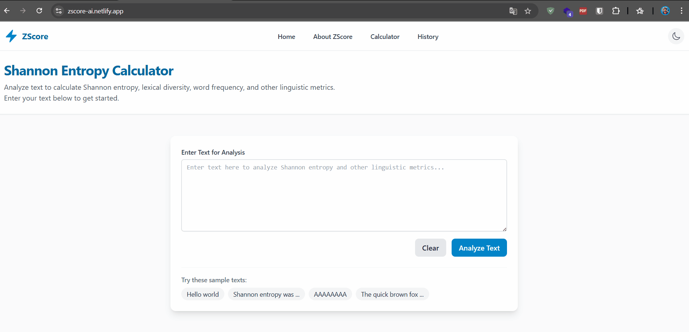

# Shannon Entropy Calculator

A sophisticated web application for text analysis and Shannon entropy calculation. This application provides insights into text complexity, lexical diversity, and information content through statistical analysis.

[](https://app.netlify.com/sites/zscore-ai/deploys)

## 🚀 Live Demo  
🔗 [Click here to try the Shannon Entropy Calculator](https://zscore-ai.netlify.app/)


## Features

- **Text Analysis**: Analyze any text input for statistical properties
- **Word Count**: Get the total number of words in the text
- **Unique Words**: Identify and count unique words in the text
- **Lexical Diversity**: Calculate the ratio of unique words to total words
- **Shannon Entropy**: Measure the information content or unpredictability of text
- **Word Frequency**: Visualize the frequency distribution of words
- **Analysis History**: Save and review past analyses with persistent storage
- **Multi-language Support**: Full internationalization with English and Turkish languages
- **Responsive Design**: Optimized for both desktop and mobile devices
- **Dark/Light Mode**: Toggle between light and dark themes for comfortable viewing
- **Persistent Settings**: User preferences for language and theme are saved between sessions

## Technology Stack

- **React 18+**: Modern UI library with functional components and hooks
- **TypeScript**: Full type safety throughout the project
- **Vite**: Lightning-fast build tool and development server
- **Tailwind CSS**: Utility-first CSS framework for responsive design
- **Zustand**: Simple state management without boilerplate
- **Framer Motion**: Animation library for smooth UI transitions
- **i18next**: Complete internationalization solution
- **Persistent Storage**: Local storage for saving user preferences and history

## Getting Started

### Prerequisites

Make sure you have the following installed:
- Node.js (v16 or later)
- npm (v7 or later)

### Installation

1. Clone the repository:
```bash
git clone https://github.com/melihcanndemir/ZScore.git
cd ZScore
```

2. Install dependencies:
```bash
npm install
```

3. Run the development server:
```bash
npm run dev
```

4. Open your browser and navigate to `http://localhost:5173`

## About Shannon Entropy

Shannon entropy is a measure of the average level of information or "surprise" inherent in a variable's possible outcomes. It quantifies the expected value of the information contained in a message and is measured in bits, nats, or bans depending on the logarithm base used.

### Formula

The Shannon entropy H(X) of a discrete random variable X is given by:

```
H(X) = -Σ p(x) log₂ p(x)
```

Where:
- p(x) is the probability mass function of X
- log₂ is the binary logarithm (base 2)

In text analysis, this measures how unpredictable or informative the text is. Higher entropy indicates more diverse, unpredictable text, while lower entropy suggests more predictable, repetitive text.

## 🌐 Internationalization

The application supports multiple languages:
- English (default)
- Turkish

Language settings are automatically saved and restored between sessions. You can switch languages using the language toggle in the navigation bar.

## 📱 Mobile Support

The application is fully responsive and optimized for mobile devices:
- Adaptive layout for different screen sizes
- Touch-friendly interface
- Hamburger menu for navigation on small screens
- Optimized reading experience on mobile devices

## 📜 ZScore Manifesto  
Learn about the philosophy and design process behind this project.  
🔗 [Read the manifesto](./zscore-manifesto.md)

## 🧪 Try These Samples
- "The sky above the port was the color of television, tuned to a dead channel."
- "All human beings are born free and equal in dignity and rights."
- "AAAAAAAAAAAAAAA"

## 🖼 Preview




## License

This project is licensed under the MIT License - see the [LICENSE](LICENSE) file for details.

## Acknowledgments

- Claude Shannon for his groundbreaking work in information theory
- The React team for their excellent framework
- The open-source community for providing amazing tools
- Contributors who helped improve the project
